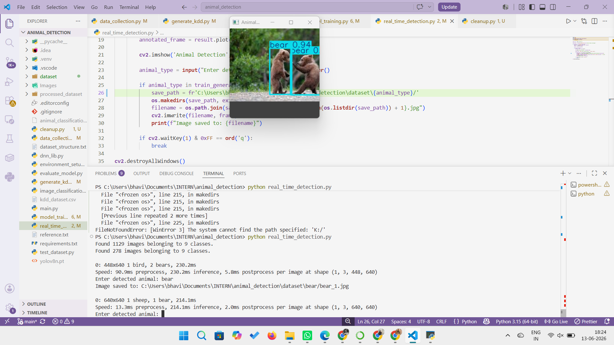
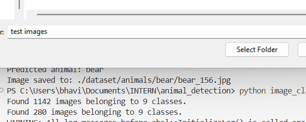

# Automated Wildlife Detection & KDD System

> Real-time wildlife animal detection using **YOLOv8n** + a custom **7-layer CNN classifier** across 9 animal species, with automated **KDD database generation** for structured research archival.


---

## 📌 Demo

> 📸 _Add your detection output screenshot here_
> 
> 
> 
> 

---

##  Overview

Wildlife monitoring traditionally requires researchers to manually review thousands of camera trap images — a process that takes days or weeks. This project automates the entire pipeline using two AI models working in tandem:

- **YOLOv8n** detects and localizes animals in images in real time by drawing bounding boxes
- **Custom CNN** classifies the detected animal into one of 9 species
- **KDD pipeline** extracts and stores structured metadata from every processed image into a CSV database for research use

Built as part of a research internship at the **Department of Computer Science, Pondicherry University**.

---

##  Animal Classes (9 Species)

| # | Class | # | Class |
|---|-------|---|-------|
| 1 | 🐻 Bear | 6 | 🦁 Lion |
| 2 | 🦌 Deer | 7 | 🐒 Monkey |
| 3 | 🫏 Donkey | 8 | 🐯 Tiger |
| 4 | 🦒 Giraffe | 9 | ❓ Unknown |
| 5 | 🐴 Horse | | |

---

##  Results

| Metric | Value |
|--------|-------|
| CNN Validation Accuracy | **92%** |
| Animal Classes | **9** |
| Detection Model | **YOLOv8n (nano)** |
| Training Epochs | **10** |
| Input Image Size | **224 × 224 px** |
| Train / Val Split | **80% / 20%** |
| Optimizer | **Adam** |
| Loss Function | **Categorical Cross-Entropy** |

---

##  Project Structure

```
animal_detection/
│
├── main.py                   # Entry point — runs all steps in order
├── environment_setup.py      # Imports all required libraries
├── dnn_lib.py                # Suppresses TensorFlow warnings
├── data_collection.py        # Image preprocessing + data generators
├── model_training.py         # CNN architecture + training
├── evaluate_model.py         # Loads model + prints validation accuracy
├── real_time_detection.py    # YOLOv8 bounding box detection on images
├── image_classification.py   # CNN prediction + auto-sorts into folders
├── generate_kdd.py           # Generates structured KDD CSV database
├── test_dataset.py           # Quick model testing on new images
├── yolov8n.pt                # Pre-trained YOLOv8 nano weights
├── requirements.txt          # All dependencies
│
├── dataset/
│   └── animals/
│       ├── bear/
│       ├── deer/
│       ├── donkey/
│       ├── giraffe/
│       ├── horse/
│       ├── lion/
│       ├── monkey/
│       ├── tiger/
│       └── unknown/
│
├── processed_dataset/
│   └── animals/              # Gray, blurred, edge versions of images
│
└── results/
    ├── detection_output.png
    ├── accuracy.png
    ├── kdd_sample.png
    └── demo.gif
```

---

##  How It Works — Pipeline

```
Input Images
     │
     ▼
┌─────────────────────────────┐
│   data_collection.py        │
│  • Resize to 224×224        │
│  • Normalise pixels /255    │
│  • Augment (flip, rotate,   │
│    zoom, shift)             │
│  • Grayscale + Blur + Edge  │
└────────────┬────────────────┘
             │
     ┌───────┴────────┐
     ▼                ▼
┌─────────┐    ┌──────────────┐
│ YOLOv8n │    │  Custom CNN  │
│ Detects │    │  Classifies  │
│ WHERE   │    │  WHAT it is  │
└────┬────┘    └──────┬───────┘
     │                │
     └───────┬────────┘
             ▼
┌─────────────────────────────┐
│   generate_kdd.py           │
│  Saves metadata to CSV:     │
│  label, datetime, area,     │
│  width, height, paths       │
└─────────────────────────────┘
             │
             ▼
    kdd_dataset.csv
```

---

##  CNN Architecture

```
Input (224 × 224 × 3)
        │
Conv2D (32 filters, 3×3, ReLU)
        │
MaxPooling2D (2×2)
        │
Conv2D (64 filters, 3×3, ReLU)
        │
MaxPooling2D (2×2)
        │
Conv2D (128 filters, 3×3, ReLU)
        │
MaxPooling2D (2×2)
        │
Flatten
        │
Dense (256 neurons, ReLU)
        │
Dense (9 neurons, Softmax)
        │
Output: Animal Class Probabilities
```

---

##  KDD Database

Every processed image generates a record in `kdd_dataset.csv` containing:

| Column | Description |
|--------|-------------|
| `original_image` | Path to original image |
| `label` | Animal class name |
| `datetime` | Timestamp of processing |
| `gray_image` | Path to grayscale version |
| `blurred_image` | Path to Gaussian blurred version |
| `edge_image` | Path to Canny edge-detected version |
| `area` | Edge pixel count (structural complexity) |
| `width` | Image width in pixels |
| `height` | Image height in pixels |

---

##  Installation & Setup

### 1. Clone the repository
```bash
git clone https://github.com/Bhavishas2725/wildlife-detection.git
cd wildlife-detection
```

### 2. Install dependencies
```bash
pip install numpy pandas matplotlib tensorflow ultralytics opencv-python pillow
```

### 3. Prepare your dataset
Organize your images into the following folder structure:
```
dataset/animals/
    ├── bear/      (place bear images here)
    ├── deer/
    ├── tiger/
    └── ...
```

### 4. Run the full pipeline
```bash
python main.py
```

### 5. Or run individual steps
```bash
python model_training.py       # Train the CNN
python evaluate_model.py       # Check accuracy
python real_time_detection.py  # Run YOLO detection
python image_classification.py # Classify and sort images
```

---

##  Requirements

```
numpy
pandas
matplotlib
tensorflow
ultralytics
opencv-python
pillow
```

Install all at once:
```bash
pip install -r requirements.txt
```

---

##  Data Augmentation Applied

To prevent overfitting on limited wildlife images, the following augmentations were applied during training:

- Rotation: ±30°
- Width & Height shift: 20%
- Shear: 20%
- Zoom: 20%
- Horizontal flip: enabled
- Pixel normalisation: divide by 255 → range [0, 1]

---

##  Author

**Bhavisha S**  
B.E. Computer Science (AI & ML) — AMET University, Chennai  
Research Intern — Pondicherry University  
📧 bhavishasiva272@gmail.com  
🔗 [LinkedIn](https://linkedin.com/in/bhavishasiva-) | [GitHub](https://github.com/Bhavishas2725) | [Portfolio](https://bhavishas.netlify.app/)

---

##  License

This project is licensed under the MIT License.

---

## 🙏 Acknowledgements

- [Ultralytics YOLOv8](https://github.com/ultralytics/ultralytics) for the pre-trained detection model
- [TensorFlow / Keras](https://www.tensorflow.org/) for the CNN framework
- Department of Computer Science, Pondicherry University for research support
